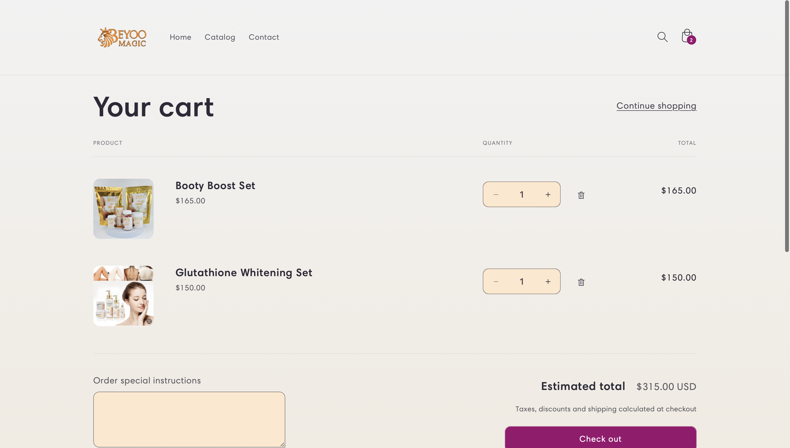

# Beyoo Magic Online Store

## Description
Beyoo Magic is an e-commerce platform designed to offer a wide range of beauty and cosmetic products. The store provides a seamless shopping experience with an elegant and user-friendly interface.

## Role and Responsibilities
I was responsible for setting up the Shopify store, customizing the theme to reflect the brand’s aesthetic, and developing several custom features to enhance the user experience. I also integrated various Shopify apps to add additional functionality.

## Technologies and Tools Used
- **Liquid**: For custom theme development.
- **HTML/CSS**: For styling and layout.
- **JavaScript**: For interactive features.
- **Shopify APIs**: For custom functionalities and integrations.
- **Apps**: Integration of apps like Mailchimp, Yotpo Reviews, and Shopify Payments.

## Custom Features
- **Custom Theme**: Developed a custom theme to match the brand’s elegant style.
- **Product Filters**: Implemented advanced product filtering options to help customers find products quickly.
- **Custom Checkout Flow**: Enhanced the checkout process with custom steps to improve conversion rates.
- **Third-Party Integrations**: Integrated with Mailchimp for email marketing and Yotpo for customer reviews.

## Challenges and Solutions
- **Challenge**: Implementing a seamless product filtering system that works efficiently with a large number of beauty products.
  - **Solution**: Used Shopify’s built-in filtering options combined with custom JavaScript to create an efficient and user-friendly filtering system.

## Screenshots

## Links
- [Live Store](https://www.beyoomagic.com)
