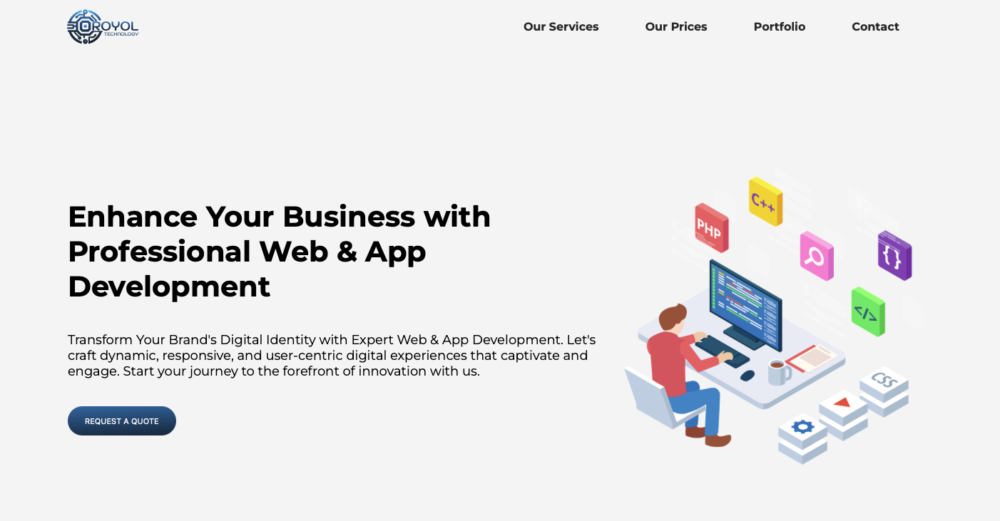
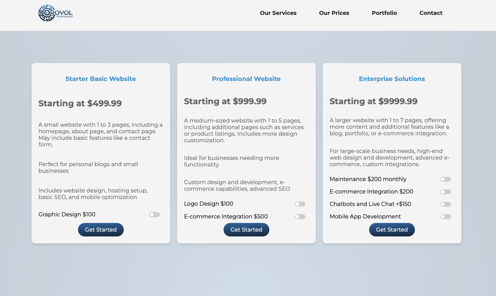

# Royol Technology LLC

## Description
Royol Technology LLC specializes in professional web and app development services, transforming digital identities for businesses. We craft dynamic, responsive, and user-centric digital experiences that captivate and engage customers.

## Role and Responsibilities
I was responsible for the full-stack development of the website and mobile applications, including frontend and backend development. I implemented various features using HTML, CSS, JavaScript, and PHP, and integrated third-party APIs for enhanced functionality.

## Technologies and Tools Used
- **HTML/CSS**: For the structure and styling of the website.
- **JavaScript**: For interactive features and client-side functionality.
- **PHP**: For server-side logic and database interactions.
- **PayPal API**: For payment processing.
- **Facebook API**: For social media integration.
- **Mobile App Development**: Using frameworks like React Native or Flutter.

## Custom Features
- **Responsive Design**: Ensured the website and apps are fully responsive and look great on all devices.
- **E-commerce Integration**: Implemented e-commerce capabilities for online sales.
- **Advanced SEO**: Applied advanced SEO techniques to improve search engine rankings.
- **Custom Integrations**: Developed custom integrations for client-specific needs, including chatbots and live chat.
- **Mobile App Development**: Created user-friendly mobile applications for both Android and iOS platforms.

## Services Offered
- **Starter Basic Website**: Starting at $499.99
  - Includes 1 to 3 pages (homepage, about page, contact page)
  - Basic features like a contact form, website design, hosting setup, basic SEO, and mobile optimization

- **Professional Website**: Starting at $999.99
  - Includes 1 to 5 pages (additional pages like services or product listings)
  - Custom design and development, e-commerce capabilities, advanced SEO

- **Enterprise Solutions**: Starting at $9999.99
  - Includes 1 to 7 pages with additional features like a blog, portfolio, or e-commerce integration
  - High-end web design and development, advanced e-commerce, custom integrations

## Client Testimonials
- **Nathan Jean Pierre**: "Launching our website and mobile app was seamless and exceeded our expectations, all thanks to this fantastic team!"
- **Wesner Joseph**: "The transformation of our digital presence through our new site and app has been phenomenal. A five-star service!"
- **Rose Withney Joasil**: "From concept to launch, the journey was smooth and efficient. Our website and app are exactly what we dreamed of!"
- **Toussaint Manoucheca**: "The team's expertise in mobile and web technology has significantly boosted our online engagement. Truly grateful!"
- **Marianne Auguste**: "Our custom app has revolutionized how we do business, and our website is the cornerstone of our digital strategy. Outstanding work!"
- **Mariange Fanmvanyan**: "Thanks to the team, our app and website are driving growth and improving our customer service. A game-changer for our business!"
- **Francky Polas**: "The dedication to making our website and app not only functional but also visually appealing has made all the difference. Their work speaks volumes!"
- **Sweet Diamond**: "I'm amazed at how our website and app have been received by our customers. The feedback has been overwhelmingly positive!"

## Contact Information
- **Address**: 3900 Haverhill Rd N, #223507, West Palm Beach, FL 33422
- **Phone**: 239-651-9228
- **Email**: info@royoltechnology.com

## Screenshots

## Links
- [Live Site](https://www.royoltechnology.com)
- [GitHub Repository](https://github.com/username/royol-technology) (if applicable)
